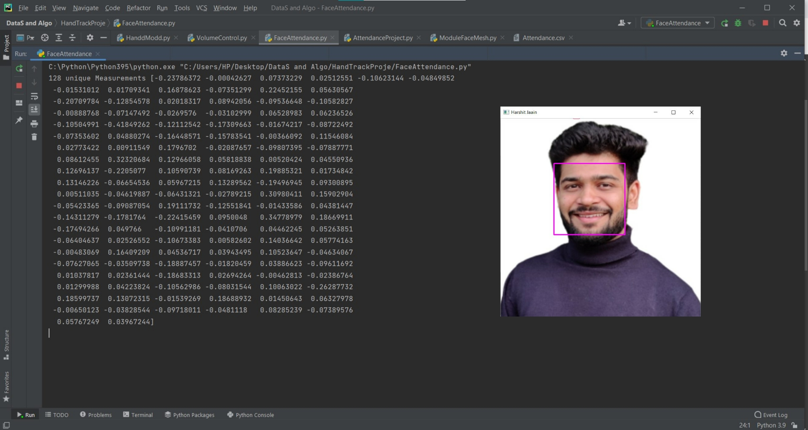

# Face Attendance Project
Initial steps & libraries used:

    install cmake (pip3 install cmake)
    install dlib (pip3 install dlib)
    install face_recognition (pip3 install face_recognition)
    install numpy (pip3 install numpy)
    intsall opencv_python (pip3 install opencv_python)
    

This is a basic facial recognition project that detects the face and mark attendace based on pre-stored images, it first turn images into
HOG(Histogram of Oriented Gradients) then with help of it capture the major features, libraries like dlib, cmake helps in it. Then for main part we encode the face with help of <i>face_encodings</i> means passing the centered face image through a neural network that knows how to measure features of the face, that gives 128 measurements to face so it can uniquely identify it. 
 
As it saves a lot of computational cost instead of comparing one image with all images in storage, it simply compares the the unique measurnments of all images( generates nearly the same numbers (measurement) when looking at two different pictures of the same person)  
Last we store the attendace in a csv file if want can connect it with database like mongodb, phpMyadmin.

<b>Face_encoding (128 unique measurnment of image)</b>

<b>Reference</b> 
Special Thanks to- 
1) https://medium.com/@ageitgey/machine-learning-is-fun-part-4-modern-face-recognition-with-deep-learning-c3cffc121d78 
2) https://www.youtube.com/channel/UCYUjYU5FveRAscQ8V21w81A

